# BYka Key Agreement Protocol

A lightweight C++ implementation of the **BYka (Blom–Yang Key Agreement)** protocol for secure key establishment in resource-constrained networks.

---

## 📖 Introduction

The BYka protocol is a symmetric key-agreement scheme that lets two parties—each holding a small public/private key set—derive a **shared secret** over an untrusted channel. It extends Blom’s original scheme by using **multiple master keys** and **multiple public key seeds** to improve resilience against node capture, while remaining efficient for IoT and wireless-sensor deployments.

---

## ⭐ Features

- **Master Key Generation**  
  Generate *N* random symmetric matrices (“master keys”) over a prime field.

- **Node Management**  
  Each node holds a unique ID, a small set of public Vandermonde vectors, and a private key set derived from all master keys.

- **Pairwise Key Derivation**  
  Compute an unordered set of scalars from permutations of private and peer public keys, then hash to a final shared secret.

- **Matrix Utilities**  
  Modular arithmetic operations and I/O (load/save) for matrices of arbitrary size.

- **TCP Socket Communication**  
  A simple `Sockets` class for request/response interaction between a Trusted Authority (TA) and nodes, and peer-to-peer exchanges.

---

## 🏗️ Architecture

This section outlines the structure of the BYka system, showing how a Trusted Authority (TA) interacts with nodes and how nodes communicate with each other.

**Key components:**

- **Trusted Authority (TA):**
  - Generates multiple symmetric master keys.
  - Assigns a unique ID and corresponding private keys to each node.
  - Keeps track of the IP addresses and ports of all registered nodes.

- **Nodes:**
  - Contact the TA to request an ID and receive their private key set.
  - Each node listens on a fixed P2P port (e.g., 6000) for incoming connections.
  - Nodes can query the TA for the IP/port of other nodes by their ID.
  - Nodes derive shared secrets using the BYka key agreement logic.

**Architecture Diagram (Mermaid):**

```mermaid
sequenceDiagram
    participant A as Node A (ID=i)
    participant B as Node B (ID=j)
    participant C as Node C (ID=k)
    participant TA as Trusted Authority (TA)

    %% Registration
    A->>TA: request_id
    TA-->>A: assign ID=i + private keys
    B->>TA: request_id
    TA-->>B: assign ID=j + private keys
    C->>TA: request_id
    TA-->>C: assign ID=k + private keys

    %% Peer discovery
    A->>TA: request_ip(j)
    TA-->>A: reply IP of B
    B->>TA: request_ip(k)
    TA-->>B: reply IP of C
    C->>TA: request_ip(i)
    TA-->>C: reply IP of A

    %% P2P connections and key exchange
    A->>B: connect & exchange public info
    B-->>A: respond
    B->>C: connect & exchange public info
    C-->>B: respond
    C->>A: connect & exchange public info
    A-->>C: respond

    %% Key derivation AB
    A->>A: compute f(Ki, Vj)
    B->>B: compute f(Kj, Vi)
    Note right of B: SharedKey_AB = hash(f(Ki,Vj) ∪ f(Kj,Vi))

    %% Key derivation BC
    B->>B: compute f(Kj, Vk)
    C->>C: compute f(Kk, Vj)
    Note right of C: SharedKey_BC = hash(f(Kj,Vk) ∪ f(Kk,Vj))

    %% Key derivation CA
    C->>C: compute f(Kk, Vi)
    A->>A: compute f(Ki, Vk)
    Note right of A: SharedKey_CA = hash(f(Kk,Vi) ∪ f(Ki,Vk))
    
```




---

## 🛠️ Prerequisites

- **C++17**-capable compiler (e.g. `g++`, `clang++`)  
- **CMake** ≥ 3.10  

---

## 🚀 Building

```bash
git clone https://github.com/your-username/BYka-key-agreement.git
cd BYka-key-agreement
mkdir build && cd build
cmake .. 
make
```
The resulting executable is **byka**.

---
## 🧪 Usage

1. **Prepare toy-example keys (optional)**  
   Copy sample master keys into the executable folder:
   ```bash
     cp toy_example/master_key_*.txt byka/
    ```

2. **Run the Trusted Authority (TA)**

    ```bash
      ./byka server
    ```
    - Listens on port 5000 for request_id and request_ip requests

    - Assigns each node a unique ID and private key set

    - Records node IPs and P2P port (6000)

3. Run each Node
    ```bash
      ./byka <TA_IP_address>
    ```

    -  Connects to the TA to obtain its ID and keys

    - Spawns a P2P listener on port 6000

    - Prompts you to enter other node IDs to discover and connect

    - Exchanges a test message to verify peer-to-peer reachability

---
## 📚 Bibliography

1. **Mee Loong Yang, Adnan Al Anbuky & William Liu**,  
   _Security of the Multiple-Key Blom’s Key Agreement Scheme for Sensor Networks_, IFIP AICT 428, 2014.  
   Thesis proposal and original description:  
   https://openrepository.aut.ac.nz/items/0d625bb1-dd4b-402f-9ce5-976d2bc806de

2. **N. Cuppens-Boulahia, P. Awad & Y. Louche**,  
   _Survey of Key Predistribution Schemes for Wireless Sensor Networks_,  
   In _Security and Privacy in Ad-Hoc and Sensor Networks_, Springer 2014.  
   Evaluation of BYka’s security among other schemes:  
   https://link.springer.com/chapter/10.1007/978-3-642-55415-5_6

3. **M. Boschetti, R. Di Pietro & G. Ventre**,  
   _Implementation of a Key Agreement Protocol for Public Transport Systems_, IEEE Xplore 2017.  
   Real-world deployment of a BYka-like scheme in transit networks:  
   https://ieeexplore.ieee.org/document/7750746

---
## Contributing

Contributions are welcome! Please feel free to submit a pull request or open an issue if you have any suggestions or find any bugs.

---
## License

This project is licensed under the MIT License - see the [LICENSE](LICENSE) file for details.


